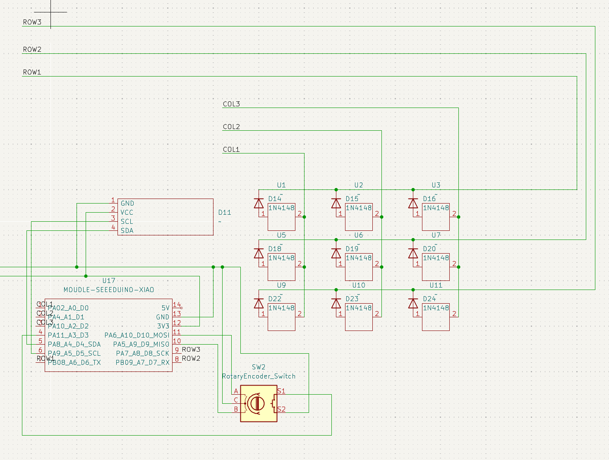
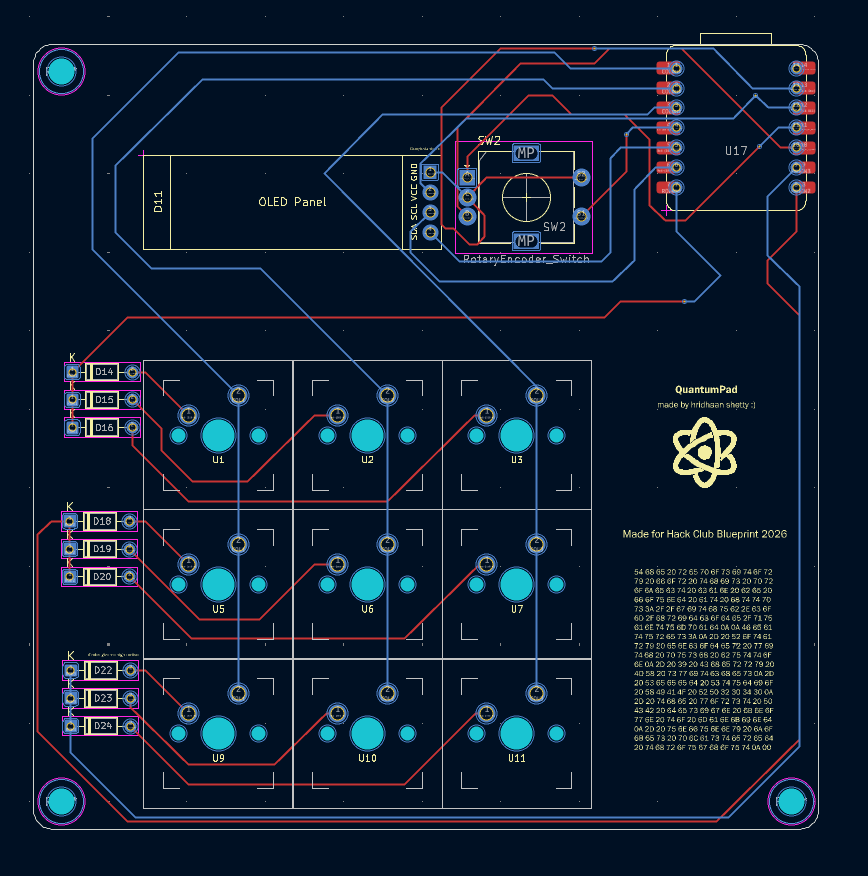
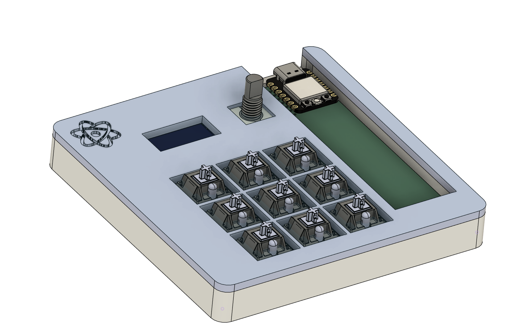

# QuantumPad

Hey everyone! This is my submission for Hack Club Blueprint 2026!
This is actually the first hardware project I've designed, and I had a lot of fun making it!

## Features

- 9 MX switches
- Seeed Studio XIAO RP2040 MCU
- KMK firmware
- Rotary encoder + push button
- OLED display

## Images

|Schematic|PCB|Macropad|
|-------|-------|-------|
||||

## Firmware

I just whipped up something quick because I don't really have anything to test it with :/ I might want to upgrade it in the future

## BOM

- 1x Seeed Studio XIAO RP2040 MCU
- 9x Cherry MX Switches
- 1x EC11 rotary encoder
- 1x 0.91" SSD1306 OLED display
- 1x Case (2 3D-printed parts)
- 4x M3x5x4mm heatset inserts
- 4x M3x16mm screws
- 9x through-hole 1N4148 diodes

## Notes

Have fun!
